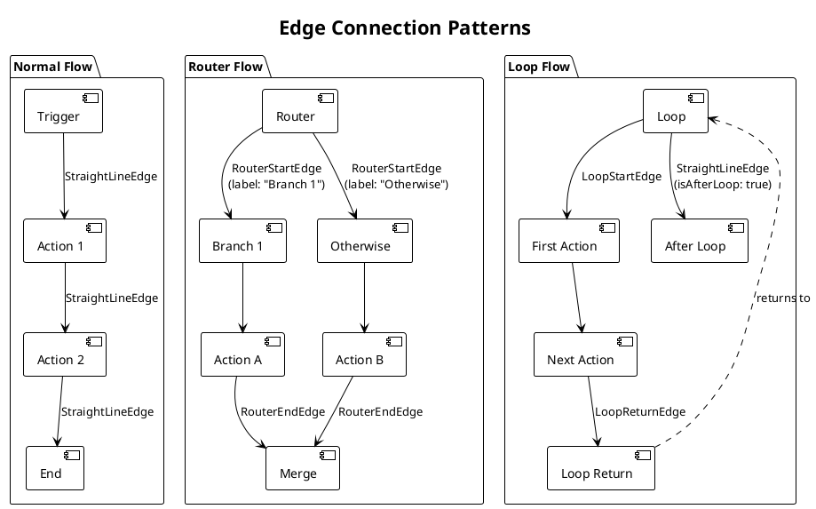
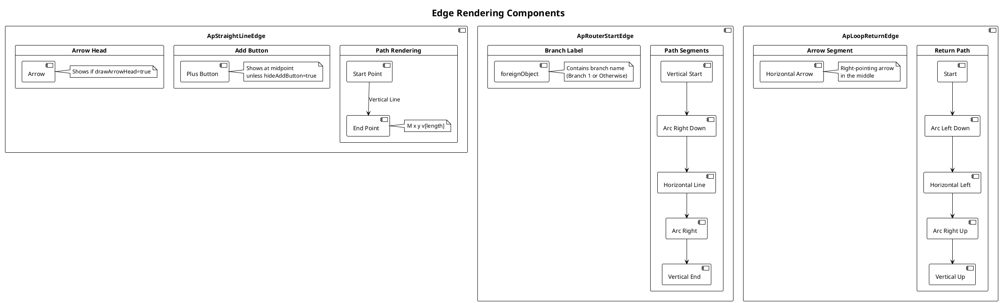
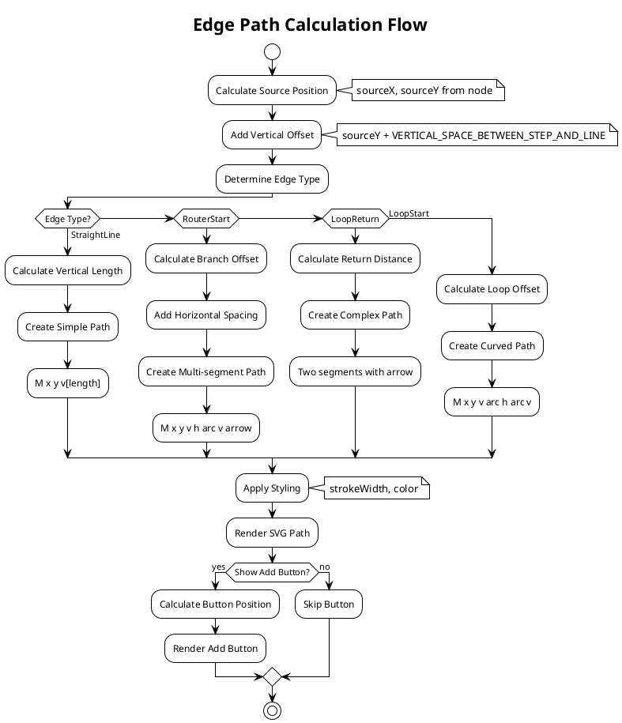
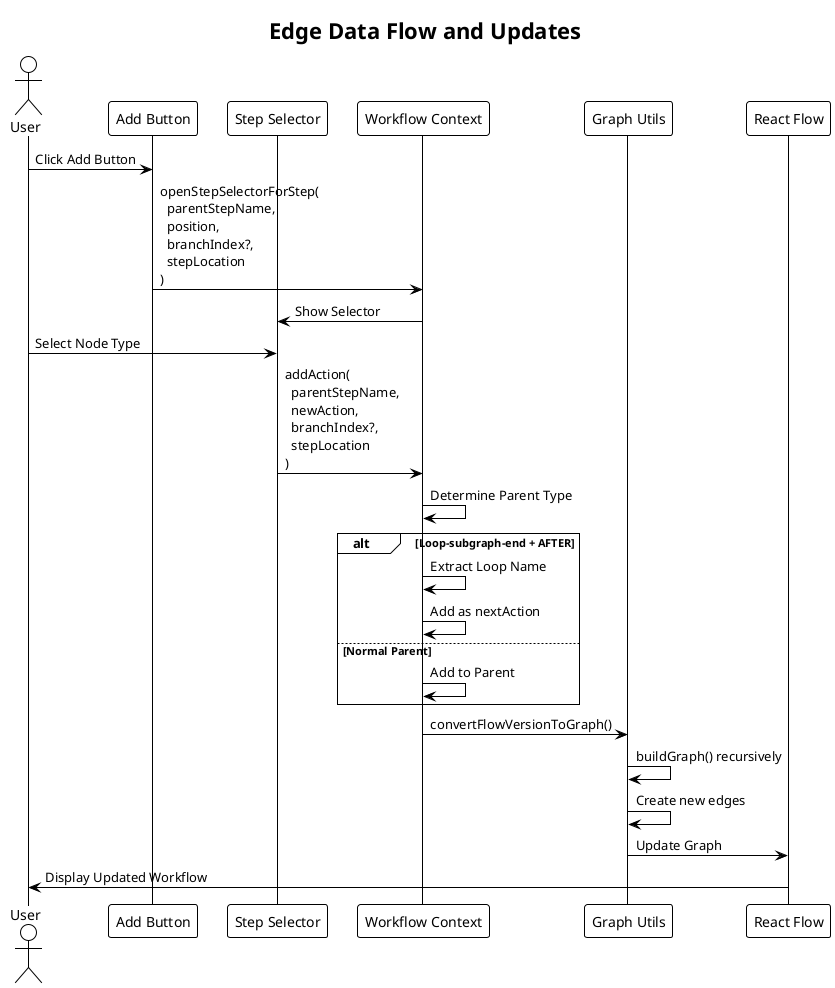
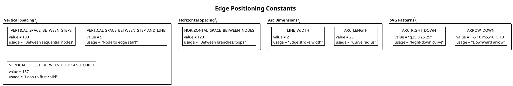
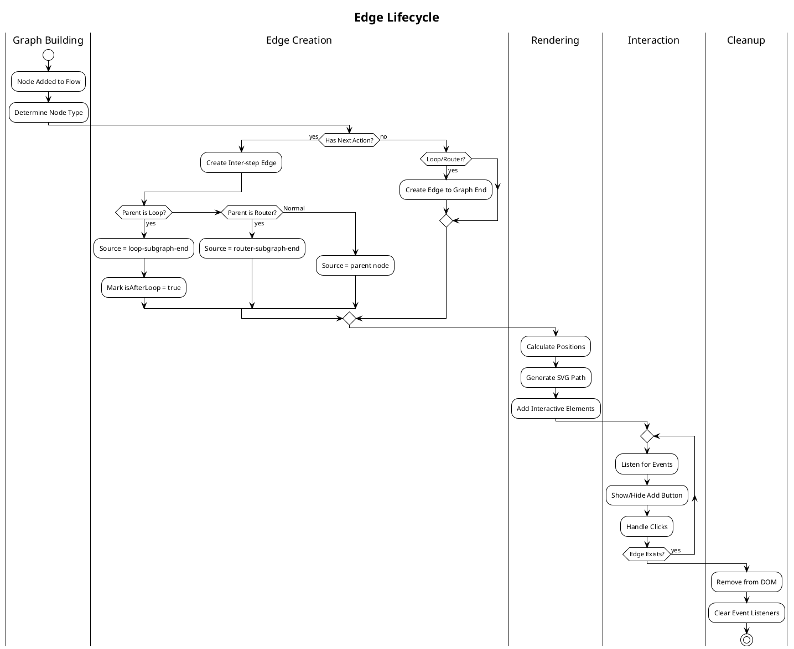

# Workflow Edges Architecture - PlantUML Diagrams

## Overview
This document contains PlantUML diagrams illustrating the edge types and their behaviors in the workflow builder system.

## Edge Types Class Hierarchy

```plantuml
@startuml
!theme plain
title Edge Types Hierarchy

abstract class ApEdge {
  +id: string
  +source: string
  +target: string
  +type: ApEdgeType
  +data: object
}

class ApStraightLineEdge {
  +type: STRAIGHT_LINE
  +data: {
    drawArrowHead: boolean
    hideAddButton?: boolean
    parentStepName: string
    isAfterLoop?: boolean
  }
}

class ApRouterStartEdge {
  +type: ROUTER_START_EDGE
  +data: {
    isBranchEmpty: boolean
    label: string
    branchIndex: number
    stepLocationRelativeToParent: string
    drawHorizontalLine: boolean
    drawStartingVerticalLine: boolean
  }
}

class ApRouterEndEdge {
  +type: ROUTER_END_EDGE
  +data: {
    drawEndingVerticalLine: boolean
    verticalSpaceBetweenLastNodeInBranchAndEndLine: number
    drawHorizontalLine: boolean
    routerOrBranchStepName: string
    isNextStepEmpty: boolean
  }
}

class ApLoopStartEdge {
  +type: LOOP_START_EDGE
  +data: {
    isLoopEmpty: boolean
  }
}

class ApLoopReturnEdge {
  +type: LOOP_RETURN_EDGE
  +data: {
    parentStepName: string
    isLoopEmpty: boolean
    drawArrowHeadAfterEnd: boolean
    verticalSpaceBetweenReturnNodeStartAndEnd: number
  }
}

ApEdge <|-- ApStraightLineEdge
ApEdge <|-- ApRouterStartEdge
ApEdge <|-- ApRouterEndEdge
ApEdge <|-- ApLoopStartEdge
ApEdge <|-- ApLoopReturnEdge

@enduml
```

## Edge Connection Patterns



## Edge Rendering Components



## Edge State Machine

```plantuml
@startuml
!theme plain
title Edge Interaction States

[*] --> Idle

Idle --> Hovering : Mouse Enter
Hovering --> ShowAddButton : Not Hidden
Hovering --> Idle : Mouse Leave

ShowAddButton --> ButtonHovered : Hover Button
ButtonHovered --> Opening : Click
ButtonHovered --> ShowAddButton : Leave Button

Opening --> StepSelector : Open Selector
StepSelector --> AddingNode : Select Node Type
AddingNode --> Idle : Node Added

state "Edge States" {
  Idle : Default state
  Hovering : Edge highlighted
  ShowAddButton : Plus button visible
  ButtonHovered : Button highlighted
}

state "Action States" {
  Opening : Opening selector
  StepSelector : Selector open
  AddingNode : Creating node
}

@enduml
```

## Edge Path Calculations



## Edge Data Flow



## Edge Positioning Constants



## Edge Lifecycle

