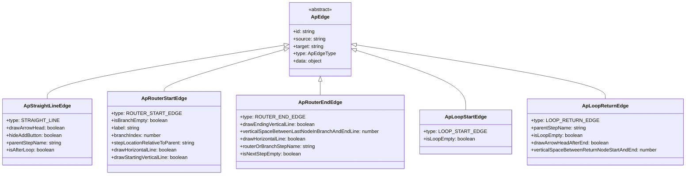
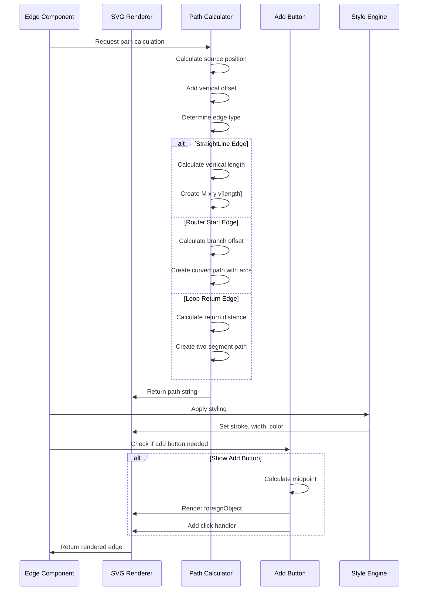
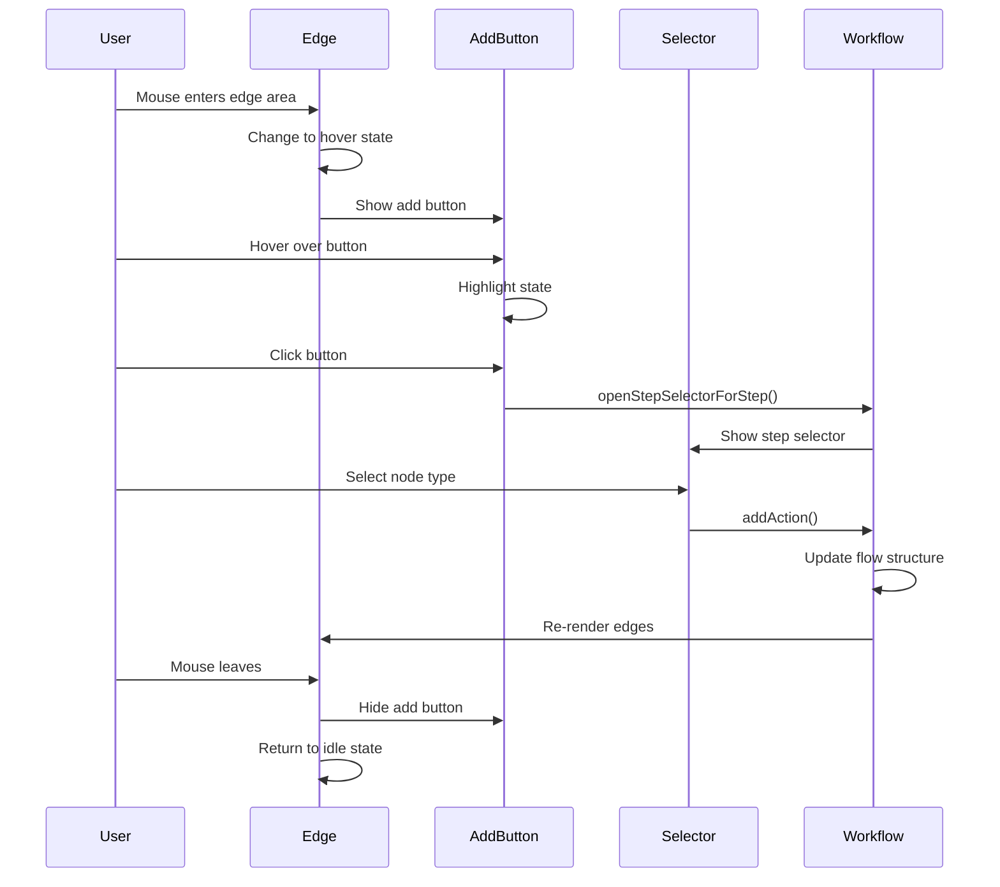
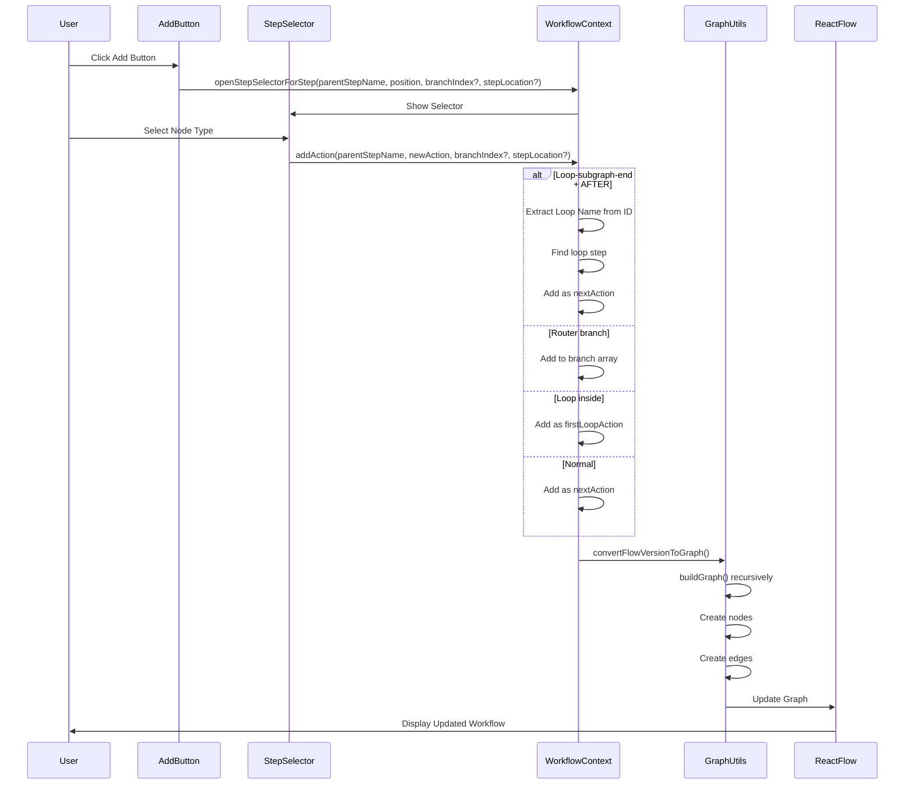
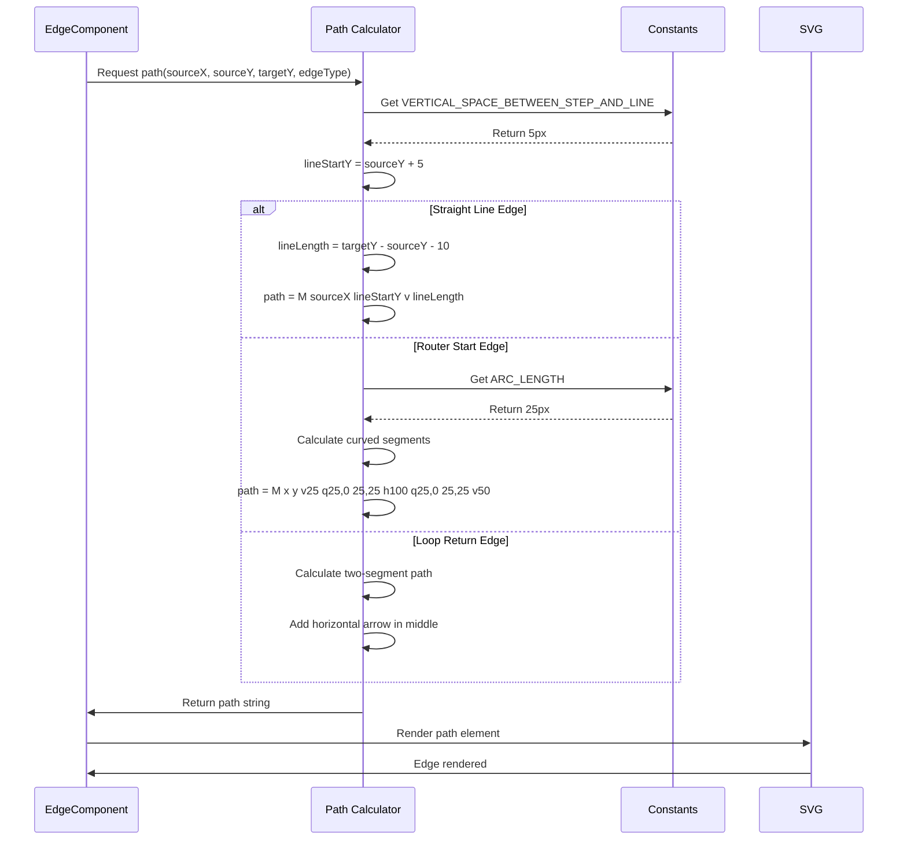
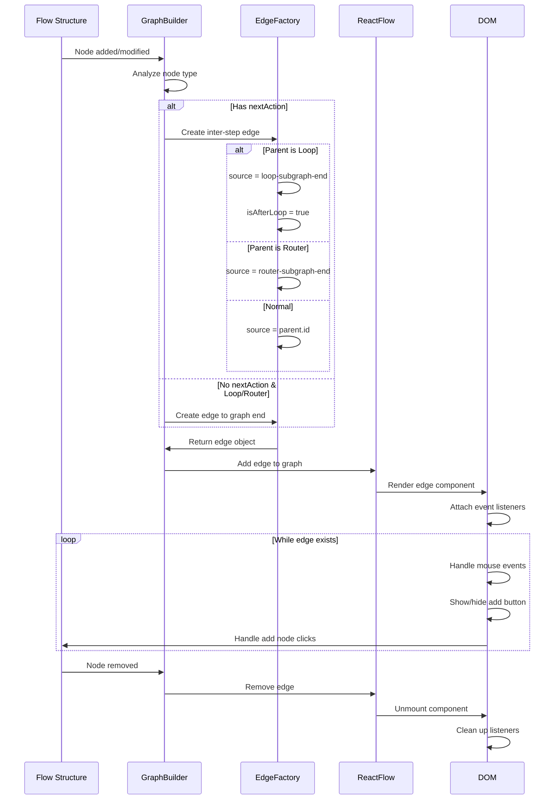
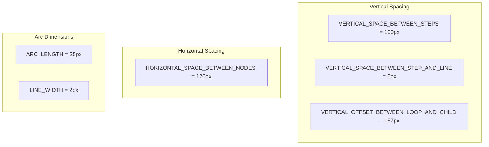

# Workflow Edges Architecture

## Overview
This document illustrates the edge types and their behaviors in the workflow builder system using Mermaid diagrams.

## Edge Types Class Hierarchy



## Edge Connection Flow Sequence

```mermaid
sequenceDiagram
    participant Trigger
    participant Action1
    participant Router
    participant Branch1
    participant Otherwise
    participant Loop
    participant LoopBody
    participant EndNode

    Trigger->>Action1: StraightLineEdge
    Action1->>Router: StraightLineEdge
    
    Router->>Branch1: RouterStartEdge (label: "Branch 1")
    Router->>Otherwise: RouterStartEdge (label: "Otherwise")
    
    Branch1->>EndNode: RouterEndEdge
    Otherwise->>Loop: StraightLineEdge
    
    Loop->>LoopBody: LoopStartEdge
    LoopBody->>Loop: LoopReturnEdge
    Loop->>EndNode: StraightLineEdge (isAfterLoop: true)
```

## Edge Rendering Sequence



## Edge Interaction State Sequence



## Edge Data Flow for Adding Nodes



## Edge Path Calculation Sequence



## Edge Lifecycle Sequence



## Edge Types Summary

| Edge Type | Connection Pattern | Visual Representation |
|-----------|-------------------|----------------------|
| **StraightLineEdge** | Sequential nodes | Vertical line with optional arrow |
| **RouterStartEdge** | Router to branches | Curved path with branch label |
| **RouterEndEdge** | Branches to merge | Curved merge path |
| **LoopStartEdge** | Loop to first action | Right-curving path |
| **LoopReturnEdge** | Last action to loop | Two-segment return path with arrow |

## Key Constants

