# Workflow Nodes Architecture

## Overview

This diagram illustrates the different types of nodes and their relationships in the workflow builder system.

## Node Types Hierarchy


## Node Flow Structure

```mermaid
graph TB
    Start[Workflow Start] --> TriggerNode[⚡ Trigger Node]

    TriggerNode --> AddBtn1{+ Add Button}
    AddBtn1 --> ActionNode1[🔧 Action Node]

    ActionNode1 --> AddBtn2{+ Add Button}
    AddBtn2 --> RouterNode[🔀 Router Node]

    RouterNode --> Branch1[Branch 1]
    RouterNode --> Otherwise[Otherwise]

    Branch1 --> AddBtn3{+ Add Button}
    AddBtn3 --> ActionNode2[🔧 HTTP Action]

    Otherwise --> AddBtn4{+ Add Button}
    AddBtn4 --> LoopNode[🔁 Loop Node]

    LoopNode --> LoopStart((Loop Start))
    LoopStart --> AddBtn5{+ Add Button}
    AddBtn5 --> ActionNode3[🔧 Code Action]
    ActionNode3 --> LoopReturn((Loop Return))
    LoopReturn --> LoopNode

    ActionNode2 --> MergePoint[Merge Point]
    LoopNode --> MergePoint

    MergePoint --> AddBtn6{+ Add Button}
    AddBtn6 --> EndNode[Workflow End]

    %% Styling
    classDef trigger fill:#e3f2fd,stroke:#1976d2,stroke-width:3px
    classDef action fill:#fce4ec,stroke:#c2185b,stroke-width:2px
    classDef router fill:#f3e5f5,stroke:#7b1fa2,stroke-width:2px
    classDef loop fill:#e8f5e9,stroke:#388e3c,stroke-width:2px
    classDef addButton fill:#fff,stroke:#666,stroke-width:1px,stroke-dasharray: 5 5
    classDef special fill:#fff3e0,stroke:#f57c00,stroke-width:2px

    class TriggerNode trigger
    class ActionNode1,ActionNode2,ActionNode3 action
    class RouterNode router
    class LoopNode loop
    class AddBtn1,AddBtn2,AddBtn3,AddBtn4,AddBtn5,AddBtn6 addButton
    class LoopStart,LoopReturn,MergePoint special
```



## Node Properties and Data Structure


## Edge Types and Connections


## Node Dimensions and Styling

| Node Type        | Width | Height | Style Properties              |
| ---------------- | ----- | ------ | ----------------------------- |
| Step Node        | 260px | 70px   | Border, shadow, hover effects |
| Big Add Button   | 50px  | 50px   | Circular, white background    |
| Graph End Widget | 30px  | 30px   | Hidden by default             |
| Loop Return Node | 20px  | 20px   | Invisible helper node         |

## Special Node Behaviors

### Router Node

- Always has exactly 2 branches: "Branch 1" and "Otherwise"
- Children array contains branch actions
- Branches merge at a common endpoint

### Loop Node

- Contains `firstLoopAction` for the loop body
- Loop return edge creates visual loop connection
- Can contain nested routers and loops

### Add Button Nodes

- Appear on edges between nodes
- Open step selector when clicked
- Context-aware (knows parent and location)

## Node Positioning Algorithm

```
1. Trigger node at (0, 0)
2. Vertical spacing: 100px between steps
3. Horizontal spacing for branches: 120px
4. Loop children offset right by: node_width + 120px
5. Return node positioned left of loop children
```
